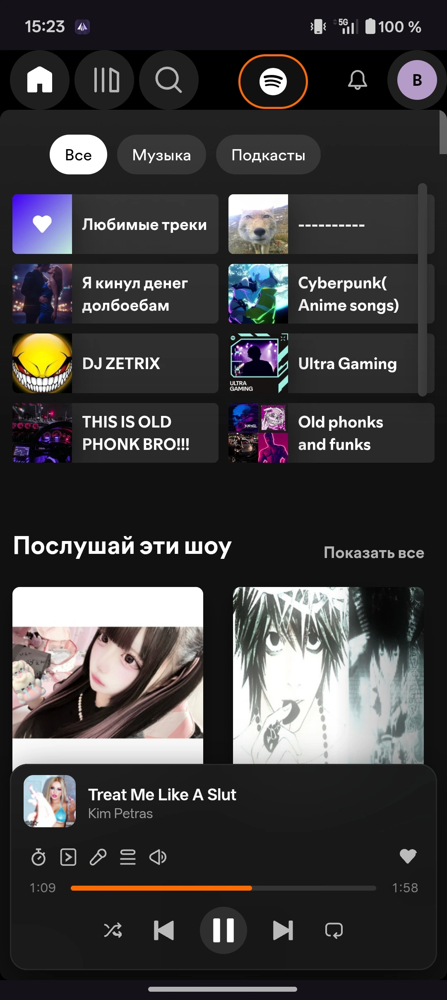
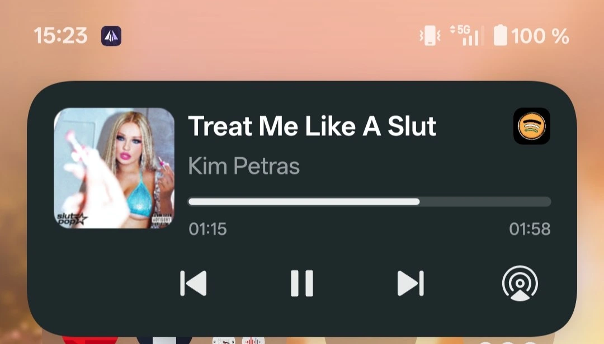
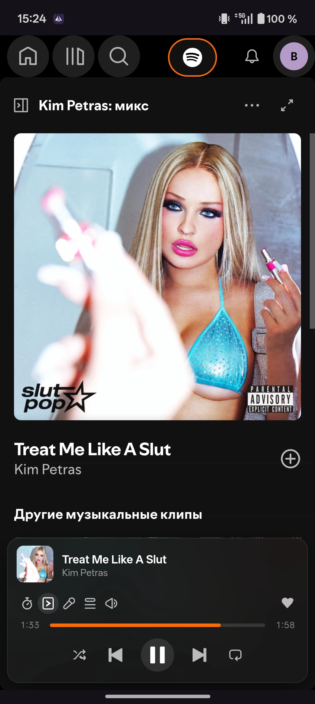

<p align="center">
  
</p>

<h1 align="center">SpotiPuk</h1>

<p align="center">
  <strong>A lightweight, fully featured Android companion for Spotify's Web Player with integrated ad-blocking capabilities.</strong>
</p>

<p align="center">
  <a href="https://github.com/Mirox921/SpotiPuk/stargazers">
    
  </a>
  &nbsp;
  <a href="https://github.com/Mirox921/SpotiPuk/releases">
    
  </a>
  &nbsp;
  <a href="https://github.com/Mirox921/SpotiPuk/releases/latest">
    
  </a>
</p>

---

## ⚡ Overview

**SpotiPuk** is an open-source Android wrapper for the Spotify web player, built entirely in Kotlin and Jetpack Compose. By routing traffic through a lightweight local MITM proxy using a custom CA certificate, SpotiPuk achieves complete, seamless audio ad-blocking and native media integration directly on your device.

This project is a modern, clean Kotlin rewrite and continuation of **Spotifuck** by **deviato**, porting the core logic from Smali bytecode into modern Android code.

---

## 📸 Screenshots

<div align="center">
  
  
  
</div>

---

## 🌟 Core Features

- **🛡️ Integrated Ad-Blocker** — Built-in local proxy blocks audio ads, banners, and analytics tracking scripts natively.
- **🎵 System Media Controls** — Complete integration with Android MediaSession (playback state, play/pause, next/previous tracks, seek bar, and liking tracks).
- **🔒 Lockscreen & Background Play** — Play your favorite tracks with your screen turned off or while using other apps.
- **✨ Autoplay Management** — Three configurable autoplay behaviors (Disabled, Play once on startup, or Permanent auto-play).
- **📱 Responsive Mobile Layout** — Beautiful custom CSS injects and layout tweaks designed to optimize Spotify's web player for any mobile screen.
- **🖤 True Dark Mode** — Full AMOLED dark styling support to save battery life.
- **🔄 Smart Updates** — Automatic checks and manual options to ensure you are always running the latest version.

---

## 🚀 Installation & First Launch

SpotiPuk uses a locally generated CA certificate to sign secure connections to Spotify web services, preventing Chrome/WebView from blocking local traffic.

1. **Download & Install**: Get the latest `.apk` from the [Releases page](https://github.com/Mirox921/SpotiPuk/releases/latest).
2. **Launch the App**: Open SpotiPuk. You will be greeted by the **Certificate Required** guide.
3. **Export Certificate**: Tap **"Export .pem"** to save the unique CA certificate file onto your device's Downloads folder.
4. **Install Certificate**:
   - Go to your device's system **Settings** ➡️ **Security** ➡️ **More Security Settings** / **Encryption & Credentials**.
   - Select **Install a certificate** ➡️ **CA certificate**.
   - Tap **Install anyway** on the security warning.
   - Select the exported `spotipuk_ca.pem` file.
5. **Start Jamming**: Return to SpotiPuk and tap **"Check"**. Once verified, you're all set!

---

## 🛠️ Build Requirements

- **Android Studio Jellyfish+** or command line tools.
- **Android SDK** (API level 28+).
- **Gradle 8.0+** with Java 17.

To build the APK manually:

```bash
# Clone the repository
git clone https://github.com/Mirox921/SpotiPuk

# Navigate into project directory
cd SpotiPuk

# Build debug build
./gradlew assembleDebug
```

The resulting package will be stored at:  
`app/build/outputs/apk/debug/app-debug.apk`

---

## 🤝 Contributing & License

Contributions are always welcome! Feel free to open issues, submit pull requests, or propose new layout adjustments. 

**SpotiPuk** is free and open-source software. Special thanks to **deviato** for reverse-engineering work on Spotifuck.

Developed and maintained with ❤️ by **Mirox921** &amp; **deviato**.
